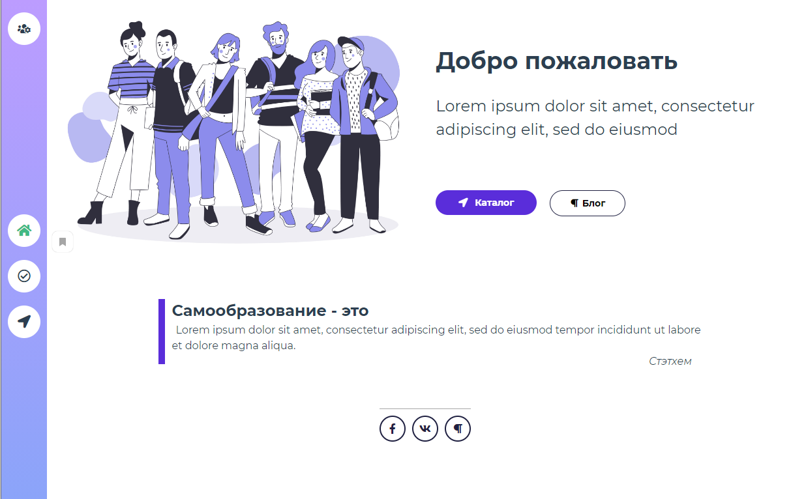
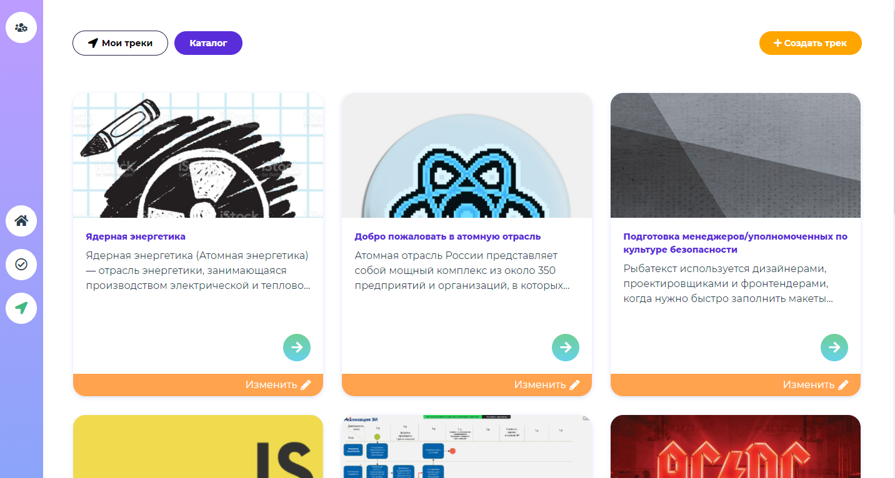
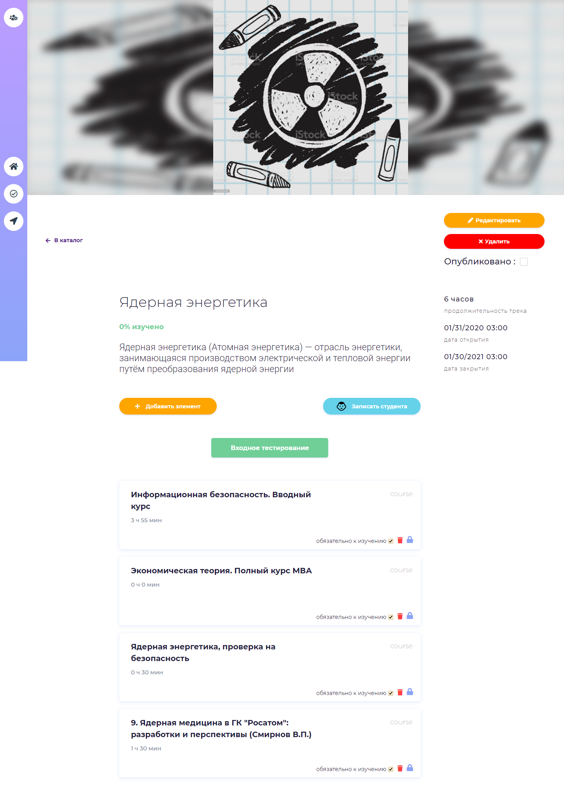
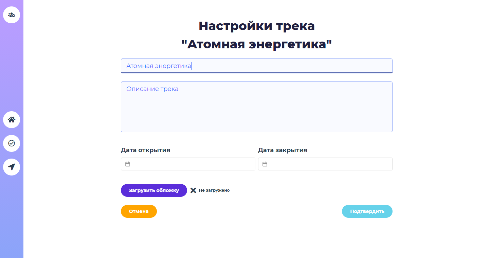
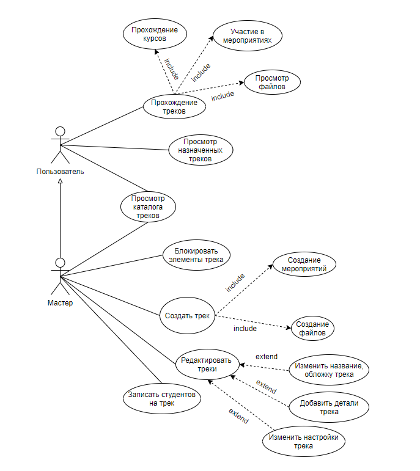

# Модуль "Треки" для веб-сервиса Record Mobile 
Record Mobile - мобильная образовательная платформа, разработанная технической академией Росатома. На платформе можно найти дистанционные курсы по различным направлениям и обучающие видеоролики.

Задачей проекта является расширение данного веб-сервиса добавлением нового функционала - Треков. 

Трек - это сборник курсов и иных обучающих материалов для студентов, желающих широко изучить тему и научиться решать конкретные задачи. Помимо каталога курсов на платформе появляется новый раздел - каталог треков.

## Демо (скриншоты)






## Используемые технологии и инструменты
1) **Framework Vue.js 3.0.**
    - *Vuex* - библитотека для предоставления компонентам методов для доступа к данным состояния
    - *Vue Router* - библиотека маршрутизации
2) Code Style стандартный. Для валидации кода используется анализатор ***ES Lint с конфигурацией Airbnb***
3) Препроцессор ***SCSS*** для работы со стилями

## Структура проекта
*скоро раздел будет дополнен*

## Роли внутри сервиса
В рамках веб-сервиса реализована две возможные роли пользователей - ***студент*** и ***мастер треков(администратор)***.

Студенту и администратору доступны **следующие возможности**:

- Просмотр каталога треков и назначенных треков
- Просмотр содержимого карточки трека
- Прохождение треков

**Возможности администратора**:

- Изменение настроек трека (редактирование обложки, названия, даты старта, даты закрытия, последовательности прохождения элементов)
- Добавление деталей трека
- Изменение деталей трека (удаление, блокировка, установка обязательности прохождения, перемещение относительно друг друга) 
- Запись студентов на трек



## Необходимые условия для использования продукта

Требуется установка следующих компонентов:
```
npm install
```
```
npm install -g yarn
```
```
npm install -g @vue/cli`
```

### Клонирование
```
$ git clone https://github.com/ANSNEKIT/case-lab-web-team4
```
### Запуск
```
npm run serve
```

### Сборка
```
npm run build
```

### Lints and fixes files
```
npm run lint
```
## Ссылки на документацию к используемым технологиям
1) **Vue.js 3.0**: https://v3.vuejs.org/guide/introduction.html#what-is-vue-js
    - на русском языке для версии 2.0 https://ru.vuejs.org/v2/guide/

2) **Vue Router**: https://router.vuejs.org/ru/

3) **Vuex**: https://vuex.vuejs.org/ru/

4) **SASS/SCSS**: https://sass-scss.ru/

5) **ES Lint**: https://eslint.org/docs/user-guide/getting-started

6) **Node.js**: https://nodejs.org/ru/docs/

## Команда разработки
### Разработчики
* Шредер Анастасия([AnastasiaShreder][1]) - руководитель, Scrum-master 
* Амельченко Никита([ANSNEKIT][2]) - Product-owner 
* Гараев Равиль([Sableuze][3]) 
* Салаватов Михаил([HoboHub][4]) 
* Вячеслав

### Аналитики
* Царькова Мария
* Жиленко Анна
* Ткачева Екатерина

[1]: https://github.com/AnastasiaShreder 
[2]: https://github.com/ANSNEKIT
[3]: https://github.com/Sableuze
[4]: https://github.com/HoboHub
[5]: https://www.figma.com/file/05LdoVEPP2LCnmtdBUBFnn/Case-Lab-Web-ver.-3?node-id=0%3A1

## Дополнительные ссылки:
Дизайн-макет доступен для просмотра в [Figma][5] 
### Customize configuration
See [Configuration Reference](https://cli.vuejs.org/config/).
